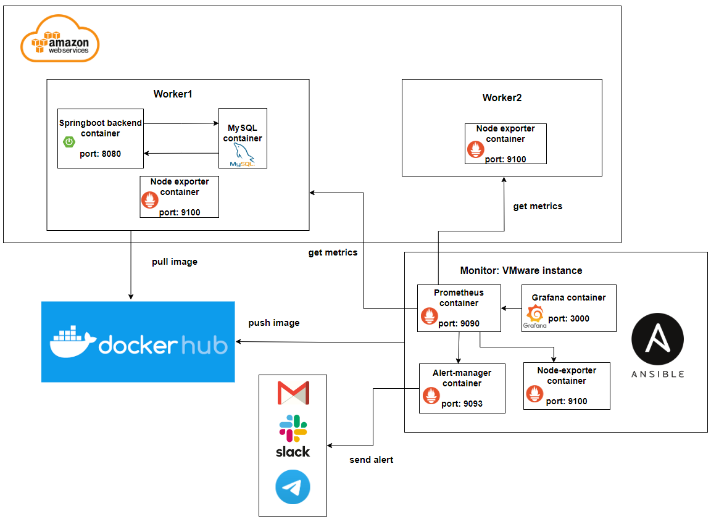
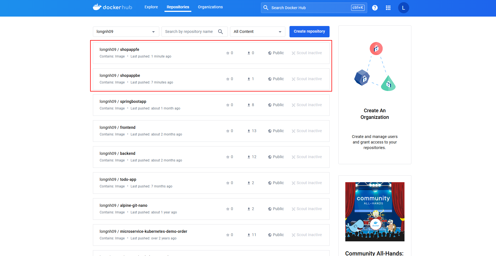
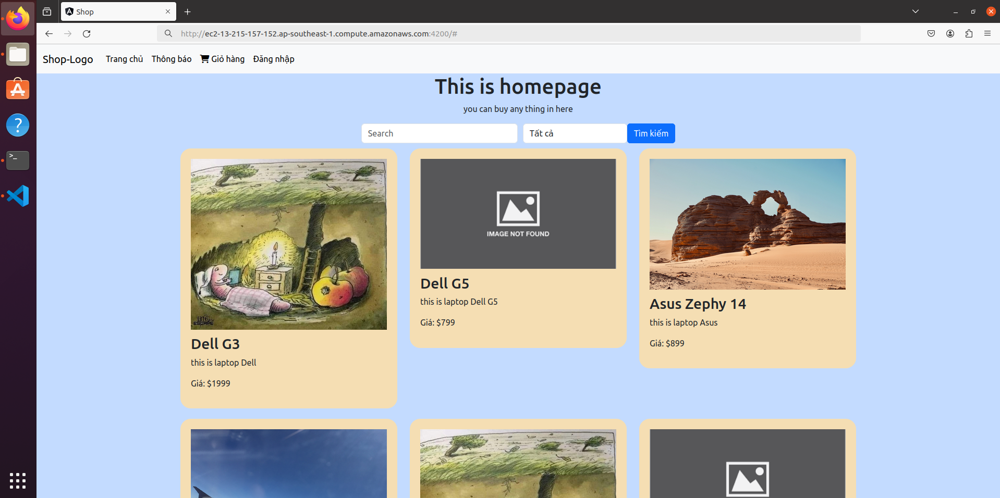

# Deploy Prometheus + Alertmanager + Grafana stack to monitor server using Ansible

## I. Requirements

1. Deploy Prometheus-Grafana-Alertmanager stack and Web application
   * Using docker, docker-compose, ansible to deploy
2. Define alert rules to monitoring  target hosts
3. Configure Alertmanager to push alert to Telegram, Slack, Mail...
4. Create Grafana dashboards to monitoring target hosts

## II. System Architecture

### 1. Overview
   * 2 machines on AWS to deploy web application.
   * 1 machine on VMWare to deploy monitoring system.
   * Using Ansible to deploy web app, monitoring system, package... on 3 above machines.
     
### 2. Monitor machine
I will create a monitor machine on Vmware Workstation 17 Player (Ubuntu 20.04), then I deploy Prometheus-Grafana-Alertmanager stack using docker, docker-compose and Ansible on this machine

### 3. Worker machines
I will create 2 EC2 instances (Ubuntu 20.04) on AWS for worker nodes
- Worker1 for deploy web application and Node exporter
  - Web app: http://ec2-18-138-227-65.ap-southeast-1.compute.amazonaws.com:9333
  - Node exporter: http://ec2-18-138-227-65.ap-southeast-1.compute.amazonaws.com:9100
    
- Worker2 for only Node exporter
  - Node exporter: http://ec2-47-128-74-122.ap-southeast-1.compute.amazonaws.com:9100

I use Ansible to deploy web app and node exporter on 2 ec2 worker. Because I will need to get the node_exporter metrics from port 9100, so I need to change the Inbound rules of security group to allow access our EC2 instances in port 9100.

### 4. Diagram

  

  <i>Deployment diagram.</i>

## III. Deploy result
### 1. Run ansible-playbook to set up monitor and worker machines

- Run successfully
  
  

    
  

  <i>Result after run ansible-playbook</i>

- Check image on Dockerhub

  

    
  

  <i>Backend image and Frontend image were pushed to Dockerhub</i>

- Test Webapp deployment on AWS EC2
  
  

    
  

  <i>Web app is hosted at http://ec2-18-138-227-65.ap-southeast-1.compute.amazonaws.com:9333/</i>

- Check Prometheus targets
  
  

    
  

  <i>All targets are upped</i>

- Add Prometheus data source in Grafana

  

    
  

  <i>Assign data source in Grafana</i>

- Grafana dashboards

  

  <i>Monitor machine dashboard</i>

  

  <i>Worker1 dashboard</i>

  

  <i>Worker2 dashboard</i>

### 2. Alertmanager send alerts to Telegram, Slack, Gmail

- When two worker have disconnected, status at Prometheus targets is Down

  

  <i>Workers are downed</i>

- Alerts ares pushed to Alertmanager from Prometheus
  

  

  <i>Alerts about PrometheusTargetsMissing</i>

- Alerts are sent to Telegram
  

  

- Alerts are sent to Slack

  

- Alerts are send to Gmail

  

## IV. Software version

|  Software |  Version |
|---|---|
| Ansible | 2.12.10 |
| Docker | 26.0.0 |
| Docker Compose | 1.25.0 |
| VMware Workstation Player | 17 |

  

  
  

  
